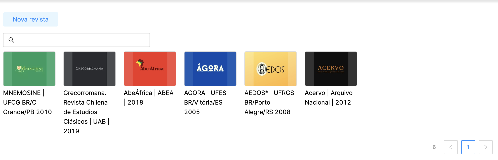
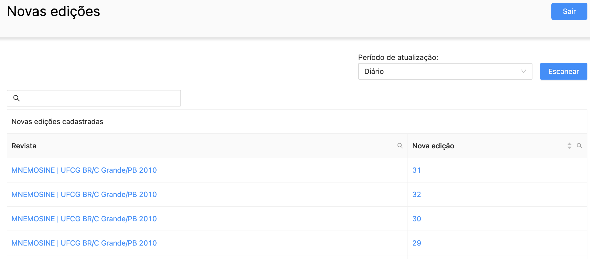
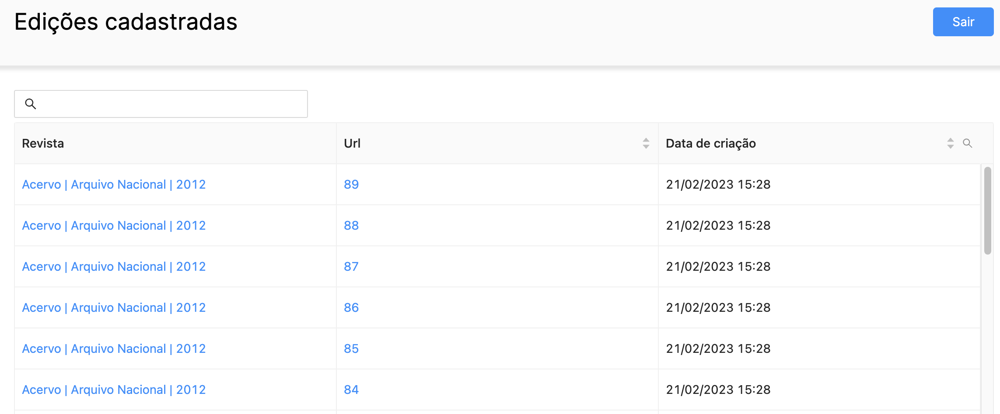

<h1 align="center"> Obclio </h1> <br>
<p align="center">
  <a href="https://obclio.com.br/">
    
  </a>
</p>

<p align="center">
  A platform that lists new editions of many magazines
  <br>
  <a href="https://obclio.com.br/">Demo</a>
</p>


<!-- START doctoc generated TOC please keep comment here to allow auto update -->
<!-- DON'T EDIT THIS SECTION, INSTEAD RE-RUN doctoc TO UPDATE -->
## Table of Contents

- [Introduction](#introduction)
- [Features](#features)
- [Future Features](#future-features)
- [Feedback](#feedback)
- [Pre Requisites](#pre-requisites)
- [Run Process](#run-process)
- [Stacks](#stacks)

<!-- END doctoc generated TOC please keep comment here to allow auto update -->

## Introduction

Obclio it's a magazine platform with the objective of list new editions of several magazines at the same time. It is possible to register and configure any magazine and then list their new editions, having the functionality to scan the magazines and notify if any new edition has been released.

<p align="center">
  
</p>

## Features

* Store magazine's information
* Store magazine's editions
* List any new editions of any magazines

## Future features

* Scan the magazines automatically
* Send notifications when a new edition is found
* Data analysis and insights generation

<p align="center">
  
</p>

<p align="center">
  
</p>

## Feedback

Feel free to send us feedback on antonio.gally@gmail.com or [file an issue](https://github.com/AntonioGally/magazine-reader/issues/new). Feature requests are always welcome.


## Pre requisites

- Docker
- Git
- Node
- Yarn
## Run Process

- `git clone https://github.com/AntonioGally/magazine-reader.git` to clone this git
- `cd api`
    - `yarn` to install dependencies
    - `docker run --name pg_obclio -e POSTGRES_USER=root -e POSTGRES_PASSWORD=root -p 5432:5432 postgres` to create and run a postgres docker image
    - create the database following the `schema` process on `./src/app/database/schema.sql`
    - create a `.env` file in `./api`
    - paste these variables
        ```
        ACCESS_TOKEN_SECRET=e8988b8110fd7edff0cc5b5f1837f9760f9ec0e6f1429d31fc6bc0be79c477abd76996014caedb8a614a72ecee57d9435e2c2929e08c27287d87ffb0158b902912281236897
        REFRESH_TOKEN_SECRET=e59712d55aaaa9287dcc86708c1894acfe8c09ef393b9e49f834fa83843df2be2008b6bab20142a9461de8d1f659d22928303273451f99ff4b4fa611ace3bf729083d92349
        LOCAL_DEVELOPMENT=true
        POSTGRES_HOST=localhost
        POSTGRES_PORT=5432
        POSTGRES_USER=root
        POSTGRES_PASSWORD=root
        POSTGRES_DATABASE=magazinereader
        ```
    - `yarn test` to run on `localhost:8080`
- `cd interface`
    - `yarn` to install dependencies
    - Change the server URL to localhost on `./src/scripts/server.ts`
    - `yarn start` to run on `localhost:3000`

    
## Stacks

- `NodeJs` with `TypeScript` for backend
- `Postgres` for Database
- `Axios` for requests
- `Cheerio` for reading html and xml
- `ReactJs` with `TypeScritp` for frontend
- `React Query` for fetching handling
- `React Redux` for state management
- `Ant Design` for components and css framework
- `Heroku` for NodeJs and postgres host
- `Netlify` for ReactJs host